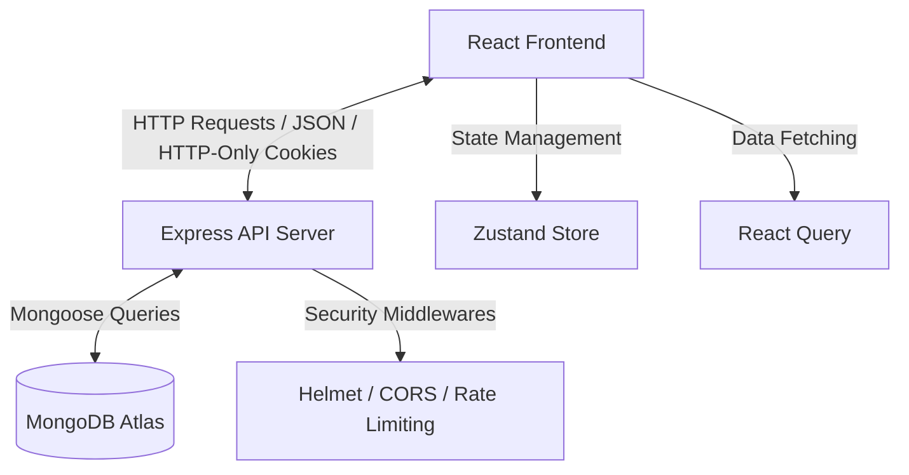

# ⚡ Modus — Modern Project Management Tool

<p align="center">
  
  
  
  
  
  
</p>

---

**Modus** is a premium, modern, and highly interactive project management tool designed to streamline workflows and enhance team collaboration. Built as a full-stack MERN application, it features high-performance UI updates, production-grade security, sleek dark mode aesthetics, and robust real-time workspace actions.

---

## ✨ Key Features

*   **📋 Interactive Kanban Board**: Drag-and-drop workflow task management powered by `@dnd-kit`, featuring dynamic list operations and clean timeline views.
*   **👥 Smart Team Collaboration**: Secure project membership invitation system with double-click and duplicate invitation prevention built directly into database transactions.
*   **👤 Custom Profile Management**: Dynamic avatar generation (using Dicebear API), password updates, and user bios.
*   **🛡️ Production-Grade Security**: Hardened with strict CORS controls, secure JWT authorization, HTTP-Only SameSite cookies, and rate-limiting.
*   **🎨 Premium UI/UX**: A stunning aesthetic featuring sleek dark modes, glassmorphism, and responsive layout designs.

---

## 🏗️ Architecture



---

## 🛠️ Tech Stack

### Frontend
- **Framework**: [React.js](https://react.dev/) (v19) with [Vite](https://vite.dev/) (v8)
- **Styling**: [Tailwind CSS](https://tailwindcss.com/) & Vanilla CSS variables
- **State Management**: [Zustand](https://github.com/pmndrs/zustand)
- **Data Fetching & Cache**: [React Query](https://tanstack.com/query/latest)
- **Drag and Drop**: [@dnd-kit/core](https://dndkit.com/)
- **Icons**: [Lucide React](https://lucide.dev/)

### Backend
- **Runtime**: [Node.js](https://nodejs.org/) (v18+)
- **Framework**: [Express.js](https://expressjs.com/) (v5)
- **Database Wrapper**: [Mongoose](https://mongoosejs.com/) (MongoDB)
- **Validation**: [Zod](https://zod.dev/)
- **Security**: [Helmet](https://helmetjs.github.io/), [CORS](https://github.com/expressjs/cors), [Express Rate Limit](https://github.com/express-rate-limit/express-rate-limit), [bcryptjs](https://github.com/dcodeIO/bcrypt.js)

---

## ⚙️ Quick Start

### Prerequisites
Make sure you have Node.js (v18+) and MongoDB installed on your system or use MongoDB Atlas.

### 1. Server Configuration
1. Navigate to the server directory:
   ```bash
   cd server
   ```
2. Copy the environment template and set up your variables:
   ```bash
   cp .env.example .env
   ```
3. Open `.env` and fill in the required fields:
   *   `MONGODB_URI`: Your MongoDB connection string.
   *   `JWT_SECRET` & `JWT_REFRESH_SECRET`: Secure cryptographic keys for authentication.
   *   `CLIENT_URL`: `http://localhost:5173` (default client URL).
4. Install backend dependencies:
   ```bash
   npm install
   ```
5. Start the backend development server:
   ```bash
   npm run dev
   ```

### 2. Client Configuration
1. Navigate to the client directory:
   ```bash
   cd ../client
   ```
2. Copy the environment template:
   ```bash
   cp .env.example .env
   ```
3. Configure the environment variable:
   *   `VITE_API_URL`: `http://localhost:5000/api` (default server URL).
4. Install frontend dependencies:
   ```bash
   npm install
   ```
5. Start the client development server:
   ```bash
   npm run dev
   ```

---

## 📂 Project Structure

```text
├── client/                     # React Frontend Application
│   ├── src/
│   │   ├── components/         # Reusable UI elements (cards, lists, modals)
│   │   ├── pages/              # Primary view screens (Dashboard, Login, Board)
│   │   ├── store/              # Zustand global state stores
│   │   ├── services/           # Axios API wrappers
│   │   └── App.jsx             # Main routing and layout configuration
│   └── package.json            
│
└── server/                     # Express Backend API Server
    ├── src/
    │   ├── config/             # Database connection and setup
    │   ├── controllers/        # Route controllers containing business logic
    │   ├── middleware/         # Auth, rate-limiter, and validation middlewares
    │   ├── models/             # Mongoose schemas (User, Board, List, Card)
    │   └── routes/             # Express Route definitions
    └── package.json            
```

---

## 🔌 API Routes Reference

### Authentication Routes
*Endpoint prefix:* `/api/auth`

| Method | Endpoint | Description | Auth Required |
| :--- | :--- | :--- | :---: |
| `POST` | `/register` | Register a new user | ❌ |
| `POST` | `/login` | Log in and set HTTP-only token cookie | ❌ |
| `POST` | `/logout` | Clear token cookie and log out user | ❌ |
| `POST` | `/refresh` | Refresh expired JWT access token | ❌ |
| `GET` | `/me` | Get current logged-in user profile details |  |
| `PUT` | `/profile` | Update user bio, password, or avatar |  |

### Workspace / Board Routes
*Endpoint prefix:* `/api/boards`

| Method | Endpoint | Description | Auth Required |
| :--- | :--- | :--- | :---: |
| `POST` | `/` | Create a new project board |  |
| `GET` | `/` | Retrieve all boards for current user |  |
| `GET` | `/search` | Search for users by email / name to invite |  |
| `GET` | `/invitations` | Get pending board invitations |  |
| `GET` | `/activities/all`| Get all global user activities |  |
| `GET` | `/tasks/all` | Fetch all tasks across all boards |  |
| `GET` | `/:boardId` | Get a board with nested lists and cards |  |
| `PUT` | `/:boardId` | Update board name or description |  |
| `DELETE`| `/:boardId` | Archive/delete a board |  |
| `POST` | `/:boardId/members` | Invite or add a member to the board |  |
| `POST` | `/:boardId/accept` | Accept a board invitation |  |
| `POST` | `/:boardId/decline`| Decline a board invitation |  |
| `GET` | `/:boardId/activities` | Get activities for a specific board |  |

### List Routes
*Endpoint prefix:* `/api/lists`

| Method | Endpoint | Description | Auth Required |
| :--- | :--- | :--- | :---: |
| `POST` | `/` | Create a new list in a board |  |
| `PUT` | `/:listId` | Update a list's name |  |
| `DELETE`| `/:listId` | Delete a list and its containing cards |  |

### Card Routes
*Endpoint prefix:* `/api/cards`

| Method | Endpoint | Description | Auth Required |
| :--- | :--- | :--- | :---: |
| `POST` | `/` | Create a new card in a list |  |
| `GET` | `/:cardId` | Retrieve detailed card info and comments |  |
| `PUT` | `/:cardId` | Update card title, description, or due date |  |
| `DELETE`| `/:cardId` | Archive / delete a card |  |
| `PATCH`| `/:cardId/move` | Move card within/across lists (dnd updates) |  |
| `POST` | `/:cardId/comments` | Add a comment to the card |  |

---

## 🛡️ Security Implementation Notes

> [!IMPORTANT]
> **Authentication Token Strategy**: Modus implements secure cookie-based JWT authorization using HTTP-Only and SameSite configurations to mitigate Cross-Site Scripting (XSS) and Cross-Site Request Forgery (CSRF) vulnerabilities.

> [!TIP]
> **Rate Limiting**: Rate limiters are actively configured on sensitive routes such as `/api/auth/register` and `/api/auth/login` to secure the system against brute-force attacks.

> [!WARNING]
> **Helmet Integration**: Helmet HTTP headers are integrated out-of-the-box to prevent Clickjacking, MIME type sniffing, and secure user agent connections.

---

## 📄 License
Distributed under the ISC License. See `server/package.json` for license details.